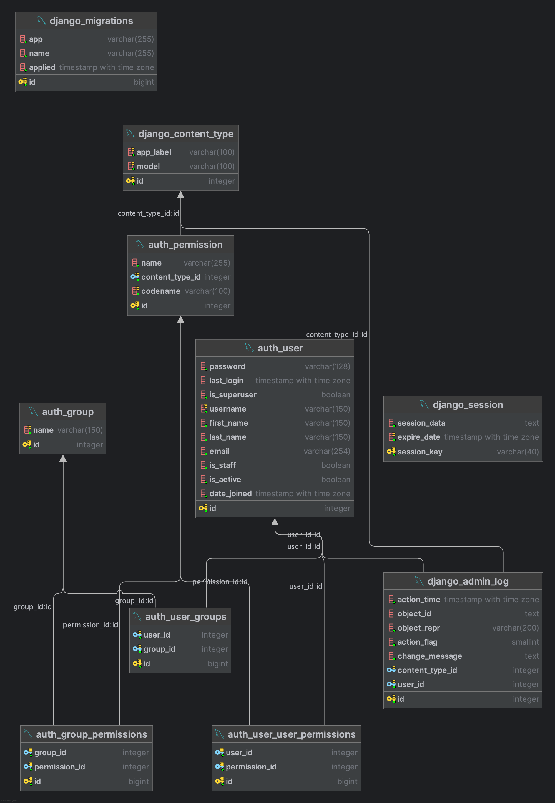

# E-commerce system with microservices

## Main technologies
* python
* django
* DRF
* postgresql
* JWT
* redis
* kong
* consul
* docker
* docker compose

## Description

The eCommerce with Microservices project tests the Django REST Framework for microservices-based projects. 
The project uses the following technologies:
1. Docker is used for containerisation.
2. Consul is used as Service Discovery and as a Load Balancer.
3. Docker Compose is used to manage the process.
4. Consul is used to find services and balance the workload.
5. Kong is used as an API Gateway.
6. Postrgesql is used as a RDBMS.
7. Redis is used as a Cache.
8. JWT is the key to securing web applications.

**All microservices have they own instance of database**

## Logging
All services logging all their activity.
In each api there is a logs directory, where logs are stored. **We set the logging level in the api.env file of each application.** 
Three logging levels are available:
- DEBUG
- INFO
- ERROR

## Service Discovery and Load Balancer
The Service Discovery and Load Balancer are handled by Consul. 
All services are logged automatically via the service_registrar script run automatically at startup with docker compose.
All services are available at address:
```http://localhost:8500/```

## Class Diagram

### Auth service


### Product service


### Cart service


### Review service


## API's Documentation

### Auth service API

```http://localhost:8001/api/schema/swagger-ui/#/```
# Auth Service API
User and jwt authentication

## Version: 1.0.0

### /api/v1/token/

#### POST
##### Description:

Takes a set of user credentials and returns an access and refresh JSON web
token pair to prove the authentication of those credentials.

##### Responses

| Code | Description |
| ---- | ----------- |
| 200 |  |

### /api/v1/token/refresh/

#### POST
##### Description:

Takes a refresh type JSON web token and returns an access type JSON web
token if the refresh token is valid.

##### Responses

| Code | Description |
| ---- | ----------- |
| 200 |  |

### /api/v1/users/

#### GET
##### Responses

| Code | Description |
| ---- | ----------- |
| 200 |  |

##### Security

| Security Schema | Scopes |
| --- | --- |
| jwtAuth | |

#### POST
##### Responses

| Code | Description |
| ---- | ----------- |
| 200 |  |

##### Security

| Security Schema | Scopes |
| --- | --- |
| jwtAuth | |

#### PUT
##### Responses

| Code | Description |
| ---- | ----------- |
| 200 |  |

##### Security

| Security Schema | Scopes |
| --- | --- |
| jwtAuth | |

#### DELETE
##### Responses

| Code | Description |
| ---- | ----------- |
| 204 | No response body |

##### Security

| Security Schema | Scopes |
| --- | --- |
| jwtAuth | |

### /api/v1/users/{id}/

#### GET
##### Parameters

| Name | Located in | Description | Required | Schema |
| ---- | ---------- | ----------- | -------- | ---- |
| id | path |  | Yes | string (uuid) |

##### Responses

| Code | Description |
| ---- | ----------- |
| 200 |  |

##### Security

| Security Schema | Scopes |
| --- | --- |
| jwtAuth | |

#### POST
##### Parameters

| Name | Located in | Description | Required | Schema |
| ---- | ---------- | ----------- | -------- | ---- |
| id | path |  | Yes | string (uuid) |

##### Responses

| Code | Description |
| ---- | ----------- |
| 200 |  |

##### Security

| Security Schema | Scopes |
| --- | --- |
| jwtAuth | |

#### PUT
##### Parameters

| Name | Located in | Description | Required | Schema |
| ---- | ---------- | ----------- | -------- | ---- |
| id | path |  | Yes | string (uuid) |

##### Responses

| Code | Description |
| ---- | ----------- |
| 200 |  |

##### Security

| Security Schema | Scopes |
| --- | --- |
| jwtAuth | |

#### DELETE
##### Parameters

| Name | Located in | Description | Required | Schema |
| ---- | ---------- | ----------- | -------- | ---- |
| id | path |  | Yes | string (uuid) |

##### Responses

| Code | Description |
| ---- | ----------- |
| 204 | No response body |

##### Security

| Security Schema | Scopes |
| --- | --- |
| jwtAuth | |


### Product service API

```http://localhost:8002/api/schema/swagger-ui/#/```
# Product service API
Product microservice

## Version: 1.0.0

### /api/v1/categories/

#### GET
##### Parameters

| Name | Located in | Description | Required | Schema |
| ---- | ---------- | ----------- | -------- | ---- |
| limit | query | Number of results to return per page. | No | integer |
| offset | query | The initial index from which to return the results. | No | integer |

##### Responses

| Code | Description |
| ---- | ----------- |
| 200 |  |

##### Security

| Security Schema | Scopes |
| --- | --- |
| basicAuth | |

### /api/v1/categories/{id}/

#### GET
##### Parameters

| Name | Located in | Description | Required | Schema |
| ---- | ---------- | ----------- | -------- | ---- |
| id | path |  | Yes | integer |

##### Responses

| Code | Description |
| ---- | ----------- |
| 200 |  |

##### Security

| Security Schema | Scopes |
| --- | --- |
| basicAuth | |

### /api/v1/categories/{id}/subcategories/

#### GET
##### Parameters

| Name | Located in | Description | Required | Schema |
| ---- | ---------- | ----------- | -------- | ---- |
| id | path |  | Yes | integer |

##### Responses

| Code | Description |
| ---- | ----------- |
| 200 |  |

##### Security

| Security Schema | Scopes |
| --- | --- |
| basicAuth | |

### /api/v1/products/

#### GET
##### Parameters

| Name | Located in | Description | Required | Schema |
| ---- | ---------- | ----------- | -------- | ---- |
| limit | query | Number of results to return per page. | No | integer |
| offset | query | The initial index from which to return the results. | No | integer |

##### Responses

| Code | Description |
| ---- | ----------- |
| 200 |  |

##### Security

| Security Schema | Scopes |
| --- | --- |
| basicAuth | |

#### POST
##### Responses

| Code | Description |
| ---- | ----------- |
| 201 |  |

##### Security

| Security Schema | Scopes |
| --- | --- |
| basicAuth | |

### /api/v1/products/{id}/

#### GET
##### Parameters

| Name | Located in | Description | Required | Schema |
| ---- | ---------- | ----------- | -------- | ---- |
| id | path | A unique integer value identifying this product. | Yes | integer |

##### Responses

| Code | Description |
| ---- | ----------- |
| 200 |  |

##### Security

| Security Schema | Scopes |
| --- | --- |
| basicAuth | |

#### PUT
##### Parameters

| Name | Located in | Description | Required | Schema |
| ---- | ---------- | ----------- | -------- | ---- |
| id | path | A unique integer value identifying this product. | Yes | integer |

##### Responses

| Code | Description |
| ---- | ----------- |
| 200 |  |

##### Security

| Security Schema | Scopes |
| --- | --- |
| basicAuth | |

#### PATCH
##### Parameters

| Name | Located in | Description | Required | Schema |
| ---- | ---------- | ----------- | -------- | ---- |
| id | path | A unique integer value identifying this product. | Yes | integer |

##### Responses

| Code | Description |
| ---- | ----------- |
| 200 |  |

##### Security

| Security Schema | Scopes |
| --- | --- |
| basicAuth | |

#### DELETE
##### Parameters

| Name | Located in | Description | Required | Schema |
| ---- | ---------- | ----------- | -------- | ---- |
| id | path | A unique integer value identifying this product. | Yes | integer |

##### Responses

| Code | Description |
| ---- | ----------- |
| 204 | No response body |

##### Security

| Security Schema | Scopes |
| --- | --- |
| basicAuth | |


### Cart service API

```http://localhost:8003/api/schema/swagger-ui/#/```
# Cart service API
Cart microservice

## Version: 1.0.0

### /api/v1/cart/

#### GET
##### Responses

| Code | Description |
| ---- | ----------- |
| 200 | No response body |

##### Security

| Security Schema | Scopes |
| --- | --- |
| basicAuth | |

### /api/v1/cart/add/

#### POST
##### Responses

| Code | Description |
| ---- | ----------- |
| 200 | No response body |

##### Security

| Security Schema | Scopes |
| --- | --- |
| basicAuth | |


### Reviews

```http://localhost:8004/api/schema/swagger-ui/#/```

# Reviews service API
Reviews microservice

## Version: 1.0.0

### /api/v1/reviews/

#### POST
##### Responses

| Code | Description |
| ---- | ----------- |
| 200 | No response body |

##### Security

| Security Schema | Scopes |
| --- | --- |
| basicAuth | |

### /api/v1/reviews/{product_id}/

#### GET
##### Parameters

| Name | Located in | Description | Required | Schema |
| ---- | ---------- | ----------- | -------- | ---- |
| limit | query | Number of results to return per page. | No | integer |
| offset | query | The initial index from which to return the results. | No | integer |
| product_id | path |  | Yes | integer |

##### Responses

| Code | Description |
| ---- | ----------- |
| 200 |  |

##### Security

| Security Schema | Scopes |
| --- | --- |
| basicAuth | |

### /api/v1/reviews/{review_id}/

#### GET
##### Parameters

| Name | Located in | Description | Required | Schema |
| ---- | ---------- | ----------- | -------- | ---- |
| review_id | path |  | Yes | integer |

##### Responses

| Code | Description |
| ---- | ----------- |
| 200 |  |

##### Security

| Security Schema | Scopes |
| --- | --- |
| basicAuth | |


## How to run

1. Clone / unzip projekt:

    ```bash
    git clone git@github.com:BlazejBielski/ecommerce_microservices.git
    ```
2. Go to the project directory
    Copy and fill environmental variables.
    ```bash
    cp envs/api.default.env envs/api.env
    ```
    ```bash
    cp envs/postgres.default.env envs/db.env
    ```

3. Filling environmental variables api.env

   **DJ_SECRET_KEY=**
   
   Django secret key. It is used to provide cryptographic signing, and should be set to a unique, unpredictable value. 
   To generate a new secret key, run the following command inside django shell:
   
   ```python 
   from django.core.management.utils import get_random_secret_key
   get_random_secret_key()
   ```
   
   **DJ_DEBUG=**
   
   An integer that specifies the debug mode. If 1, Django will use technical error responses when an exception occurs. 
   If 0, Django will display a standard page for the given exception, provided by the handler for that exception.
   
   **DJ_ALLOWED_HOSTS=**
   
   A list of strings representing the host/domain names that this Django site can serve. 
   This is a security measure to prevent an attacker from poisoning caches and password reset emails with links to malicious hosts by submitting requests with a fake HTTP 
   Host header, which is possible even under many seemingly-safe web server configurations.
   
   Hint: Multiple hosts should be separated by a space.
   
   **LOGGING_LVL=**
   Logging level for microservices logs. You can set one of these levels:
   * INFO
   * DEBUG
   * ERROR
   
   Variables used for Django superuser migration
   **DJ_SU_NAME=**
   
   **DJ_SU_EMAIL=**
   
   **DJ_SU_PASSWORD=**

4. Filling environmental variables db.env

   **POSTGRES_PASSWORD=**
   
   The password for the database.
   
   **POSTGRES_DB=**
   
   The name of the database.
   
   **POSTGRES_HOST=**
   
   The host name of the database. If you are using docker-compose, you can use the name of the service.
   
   **POSTGRES_PORT=**
   
   The port number of the database. If you are using docker-compose, you can use the port number of the service. Default port number for postgres is 5432.

5. Example of env file additions:
   ```
   DJ_SECRET_KEY="django-insecure-ih$-8kb2(_49%8t=+o^s$n=0rvpqci0d-8hgui&-phzslfi4y5"
   DJ_DEBUG=1
   DJ_ALLOWED_HOSTS=localhost 0.0.0.0 127.0.0.1
   DJANGO_LOGLEVEL='info'
   ```
   ```
   POSTGRES_USER=postgres
   POSTGRES_PASSWORD=postgres
   POSTGRES_DB=postgres
   POSTGRES_HOST=postgres
   POSTGRES_PORT=5432
   
   DB_CONNECTION_STRING=postgres://${POSTGRES_USER}:${POSTGRES_PASSWORD}@${POSTGRES_HOST}:${POSTGRES_PORT}/${POSTGRES_DB}
   ```
6. Start containers in root directory

   ```bash
   docker compose up --build.
   ```

7. Check services on API's, Service Discovery, API Gateway links
