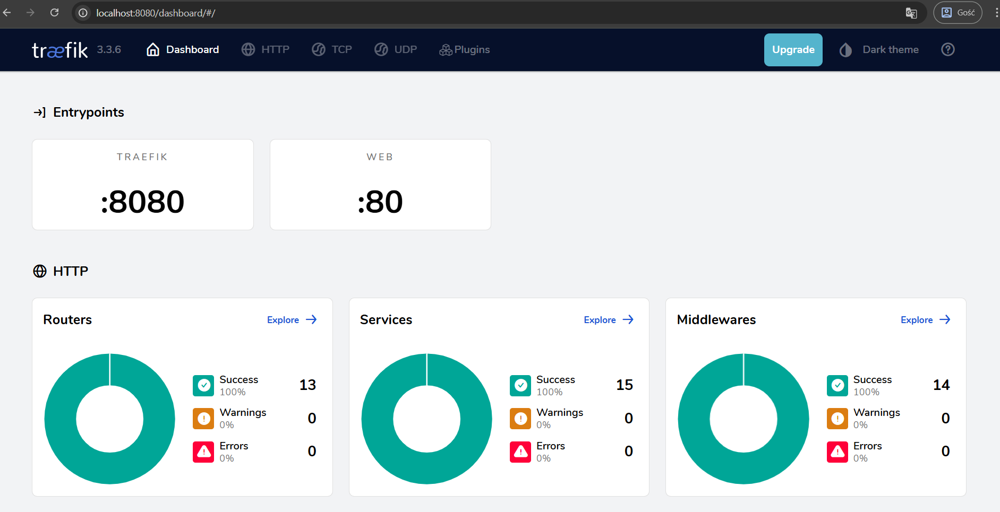
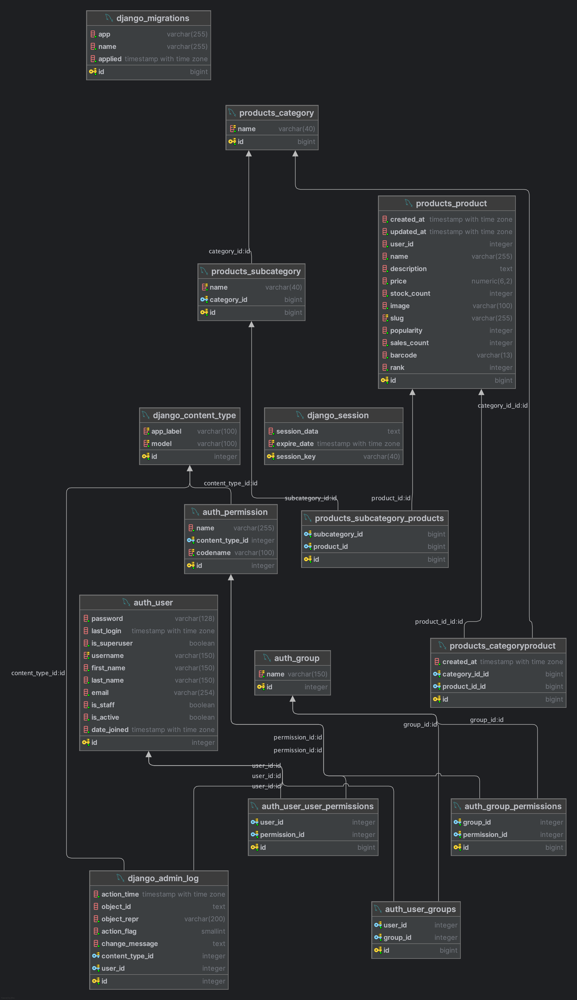

# E-commerce system with microservices

## Main technologies

* Python
* Django
* Django REST Framework (DRF)
* PostgreSQL
* JWT (JSON Web Token)
* Redis
* Traefik
* Consul
* Docker
* Docker Compose
* Vite (frontend)

---

## Description

The **eCommerce with Microservices** project tests the Django REST Framework for microservices-based architectures.

The project uses the following technologies:

1. **Docker** – containerises services.

2. **Docker Compose** – orchestrates multi-container setup.

3. **Traefik** – acts as a dynamic **API Gateway** and **Reverse Proxy**, routes HTTP(S) traffic to appropriate microservices based on domain names and paths. It also manages **SSL certificates** (Let’s Encrypt) and integrates with **Consul** for service discovery.

   

4. **Consul** – provides **Service Discovery** and simple **Load Balancing** by registering available services and their health.

   

5. **PostgreSQL** – used as the **relational database (RDBMS)**.

6. **Redis** – in-memory **cache** to reduce database load.

7. **JWT** – used for secure authentication and authorization between services.

8. **Vite** – for building the frontend.


> **Note:** Each microservice has its **own database instance**.

---

## Logging

All services log their activity. Each service has a `logs` directory. The logging level is set in the `api.env` file. Available logging levels:

* DEBUG
* INFO
* ERROR

---

## Service Discovery and Load Balancer

Consul handles service discovery and load balancing. All services register automatically using the `service_registrar` script during startup (via Docker Compose).

Services are visible at:

```
http://localhost:8500/
```


---

## Class Diagrams

### Auth Service


### Product Service



### Cart Service


### Review Service


---

## API Documentation

### Auth Service

```
http://localhost:8001/api/schema/swagger-ui/#/
```

#### Endpoints

| Method | Endpoint                 | Description                            |
| ------ | ------------------------ | -------------------------------------- |
| POST   | `/api/v1/token/`         | Login, returns access & refresh tokens |
| POST   | `/api/v1/token/refresh/` | Refresh access token                   |
| GET    | `/api/v1/users/`         | Get user list                          |
| POST   | `/api/v1/users/`         | Create new user                        |
| PUT    | `/api/v1/users/`         | Update user                            |
| DELETE | `/api/v1/users/`         | Delete user                            |
| GET    | `/api/v1/users/{id}/`    | Get user by ID                         |
| POST   | `/api/v1/users/{id}/`    | Not standard, additional logic         |
| PUT    | `/api/v1/users/{id}/`    | Update user by ID                      |
| DELETE | `/api/v1/users/{id}/`    | Delete user by ID                      |

---

### Product Service

```
http://localhost:8002/api/schema/swagger-ui/#/
```

#### Endpoints

| Method | Endpoint                                 | Description                 |
| ------ | ---------------------------------------- | --------------------------- |
| GET    | `/api/v1/categories/`                    | List categories             |
| GET    | `/api/v1/categories/{id}/`               | Category by ID              |
| GET    | `/api/v1/categories/{id}/subcategories/` | Subcategories of a category |
| GET    | `/api/v1/products/`                      | List products               |
| POST   | `/api/v1/products/`                      | Create product              |
| GET    | `/api/v1/products/{id}/`                 | Product details             |
| PUT    | `/api/v1/products/{id}/`                 | Update product              |
| PATCH  | `/api/v1/products/{id}/`                 | Partially update product    |
| DELETE | `/api/v1/products/{id}/`                 | Delete product              |

---

### Cart Service

```
http://localhost:8003/api/schema/swagger-ui/#/
```

#### Endpoints

| Method | Endpoint            | Description            |
| ------ | ------------------- | ---------------------- |
| GET    | `/api/v1/cart/`     | Retrieve cart contents |
| POST   | `/api/v1/cart/add/` | Add item to cart       |

---

### Review Service

```
http://localhost:8004/api/schema/swagger-ui/#/
```

#### Endpoints

| Method | Endpoint                        | Description               |
| ------ | ------------------------------- | ------------------------- |
| POST   | `/api/v1/reviews/`              | Add a review              |
| GET    | `/api/v1/reviews/{product_id}/` | Get reviews for a product |
| GET    | `/api/v1/reviews/{review_id}/`  | Get review by ID          |

---

## How to run

1. Clone or unzip the project:

   ```bash
   git clone git@github.com:BlazejBielski/ecommerce_microservices.git
   ```

2. Go to the project directory and copy environment variable templates:

   ```bash
   cp envs/api.default.env envs/api.env
   cp envs/postgres.default.env envs/db.env
   ```

3. Fill `api.env` with variables:

   ```env
   DJ_SECRET_KEY="<your-generated-secret-key>"
   DJ_DEBUG=1
   DJ_ALLOWED_HOSTS=localhost 0.0.0.0 127.0.0.1
   LOGGING_LVL=INFO

   DJ_SU_NAME=admin
   DJ_SU_EMAIL=admin@example.com
   DJ_SU_PASSWORD=admin123
   ```

   To generate secret key:

   ```python
   from django.core.management.utils import get_random_secret_key
   get_random_secret_key()
   ```

4. Fill `db.env` with variables:

   ```env
   POSTGRES_USER=postgres
   POSTGRES_PASSWORD=postgres
   POSTGRES_DB=postgres
   POSTGRES_HOST=postgres
   POSTGRES_PORT=5432

   DB_CONNECTION_STRING=postgres://${POSTGRES_USER}:${POSTGRES_PASSWORD}@${POSTGRES_HOST}:${POSTGRES_PORT}/${POSTGRES_DB}
   ```

5. Start containers:

   ```bash
   docker compose up --build
   ```

6. Access services via:

* **Consul UI**: [http://localhost:8500/](http://localhost:8500/)
* **Traefik Dashboard**: [http://localhost:8080/](http://localhost:8080/)
* **Swagger UI** for each service (see above for URLs)
